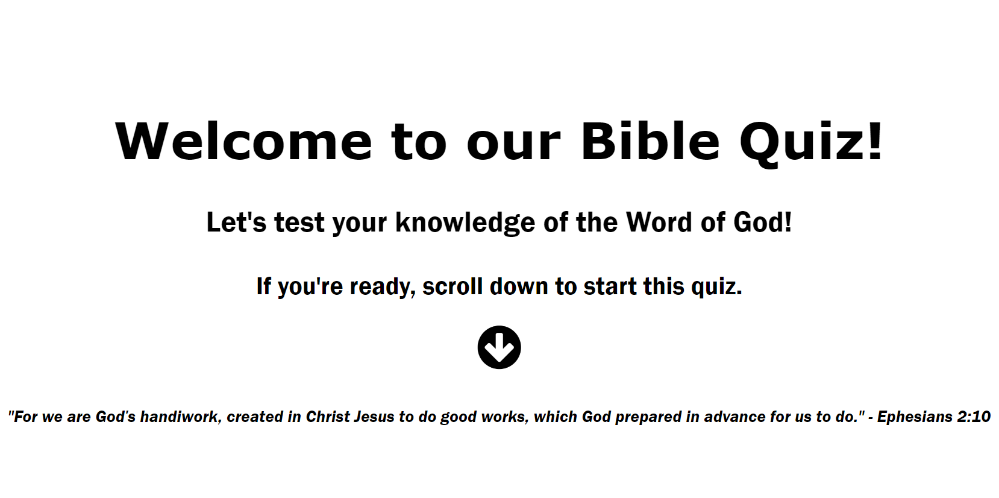

# BibleQuiz

## Overview



A simple Bible Quiz game that tests your knowledge of the Bible. The game is built using HTML, CSS, and JavaScript.

## Installation
1. Clone the repository
```bash
git clone "https://github.com/WilhenAlbertoHM/BibleQuiz"
```

2. Open the `index.html` file in your browser
3. Start the quiz and have fun!

## Future Improvements
I plan to add more questions to the quiz and different levels of difficulty. Also, I plan to add API integration to get random verses and other features from an external source.